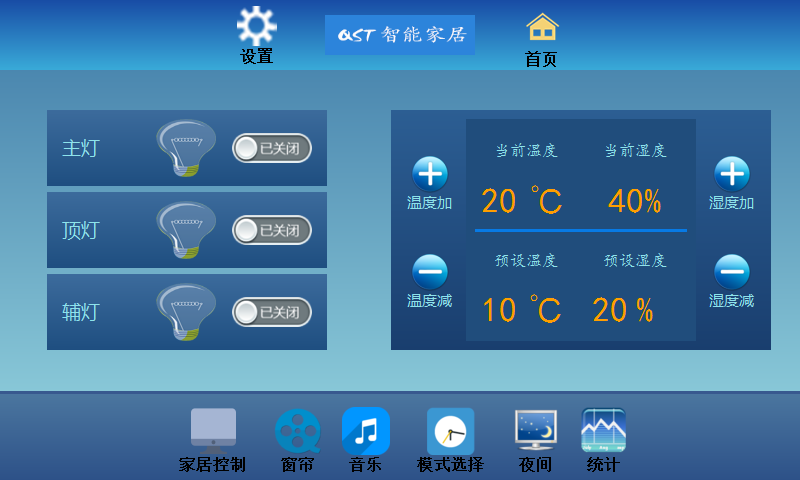

******

    作者:鹅卵石
    时间:2016年4月13日22:43:53
    版本:V 0.0.0
    邮箱:kevinlq@yeah.net


# 基于zigbee和STM32的环境监测监控系统

## 1 系统功能
详细的介绍可以看博客[http://blog.csdn.net/u013704336/article/details/51765397][1]
这个项目作为2016年的毕设，完美完成了各项要求。综合利用了所学的C语言、C++、zigbee、stm32、Qt、ARM、等嵌入式技术。
  
  ### 首页
  
  
  
 ### 控制主界面
  
  
 ### 客厅
  
  
 ### 卧室
  
  
 ### 厨房
   
  
 ### 历史曲线数据
   
   
   
   
   
   

## 2. 电路原理图
   电路图使用AD13软件进行绘制，使用的主控芯片是STM32F103
   
   
   
## 3. 编译和运行

### 3.1 下载代码到本地

```
git clone git@github.com:kevinlq/SmartHome-Qt.git
```

### 3.2 使用Qt4打开直接编译
为什么说是Qt4呢，因为当时编写基于ARM Linux 平台，使用的是Qt4，在Qt5中有一些函数方法被取消了。如果你在windows下或者其他平台使用非Qt4，那么需要自己进行修改!

### 3.3 运行
程序运行需要数据库，默认使用 `QSqlLite` 数据库，需要拷贝 `file`文件夹下的 `SmartHome.db` 文件到可执行程序同级目录下

>默认程序编译完成后，可执行程序在bin目录下

可以在工程配置文件中进行修改!
```
DESTDIR = $$PWD/bin
```


关于交叉编译，移植到ARM平台，可以参考我的这篇文档，介绍很详细! [传输门][2]


 
## 4. 如果有什么问题欢迎及时联系我
 

 
 ## 5. Change Logs
 
 - ....
 - 2018-10.14-添加程序编译及运行配置(最近有不少人问，总是编译失败，所以完善了下)
 
 
  ---
 
 >补充下，时间真快，到目前(2018年4月25日20:20:38)为止，2年了，曾经分享的这套代码喜欢的人还是很多的，
 还是很高兴。以后会继续分享的(之前这份代码确实写的比较烂)。


 [1]: http://blog.csdn.net/u013704336/article/details/51765397
 [2]: http://kevinlq.com/2015/09/11/Qt_corss_build_setting/		"kevinlq 鹅卵石的博客"