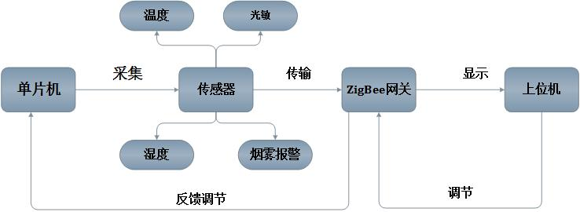

<!-- PROJECT SHIELDS -->
<!--
*** I'm using markdown "reference style" links for readability.
*** Reference links are enclosed in brackets [ ] instead of parentheses ( ).
*** See the bottom of this document for the declaration of the reference variables
*** for contributors-url, forks-url, etc. This is an optional, concise syntax you may use.
*** https://www.markdownguide.org/basic-syntax/#reference-style-links
-->
[![Contributors][contributors-shield]][contributors-url]
[![Forks][forks-shield]][forks-url]
[![Stargazers][stars-shield]][stars-url]
[![Issues][issues-shield]][issues-url]
[![MIT License][license-shield]][license-url]
[![LinkedIn][linkedin-shield]][linkedin-url]


<!-- PROJECT LOGO -->
<br />
<p align="center">
  <a href="https://github.com/kevinlq/SmartHome-Qt">
    
  </a>

  <h3 align="center">SmartHome-Qt</h3>

  <p align="center">
    基于 Zigbee 和 STM32 的环境监测监控系统
    <br />
    <a href="https://github.com/kevinlq/SmartHome-Qt"><strong>Explore the docs »</strong></a>
    <br />
    <br />
    <a href="https://github.com/kevinlq/SmartHome-Qt">View Demo</a>
    ·
    <a href="https://github.com/kevinlq/SmartHome-Qt/issues">Report Bug</a>
    ·
    <a href="https://github.com/kevinlq/SmartHome-Qt/issues">Request Feature</a>
  </p>
</p>


# 基于 Zigbee 和 STM32 的环境监测监控系统


项目设计、开发文档、以及开发资料获取方式：

**获取更多信息可以关注微信公众号：devstone**

<div align=center>


<div align=left>

## 安全认证
[](https://www.murphysec.com/accept?code=69f7806ceb54b7d3e1a8a09bff768c88&type=1&from=2&t=2)


## 项目介绍

本系统分为硬件和软件两部分内容，下位机 `STM32` 单片机驱动各个传感器模块采集数据，然后发送给 `ZigBee`  终端，`ZigBee` 终端在接收到数据后发送给协调器，协调器是和 `ARM`开发板(上位机)相连接的，`ARM` 开发板收到数据后进行相应的解析并显示在界面上。其中ARM开发板上跑的是使用 `Qt` 编写的程序，经过交叉编译后移植到了开发板上。



有关该项目详细使用说明，可以看这边博客，介绍的比较详细.[传送门][3]

## 开发环境

```
开发系统：Windows10 64位
Ubuntu 14.04 32 位
软件版本：Qt 4.8.6
IAR .0
Altium Designer 13.0
工具链:arm-linux-gcc 4.4.3
```

目前已经支持 `Qt5` 编译运行


## 编译和运行

### 下载代码到本地

```
git clone git@github.com:kevinlq/SmartHome-Qt.git

cd SmartHome-Qt

qmake SmartHomeV5.pro

```

###  使用Qt4打开直接编译
为什么说是Qt4呢，因为当时编写基于ARM Linux 平台，使用的是Qt4，在Qt5中有一些函数方法被取消了。如果你在windows下或者其他平台使用非Qt4，那么需要自己进行修改!

###  运行
程序运行需要数据库，默认使用 `QSqlLite` 数据库，需要拷贝 `file`文件夹下的 `SmartHome.db` 文件到可执行程序同级目录下

>默认程序编译完成后，可执行程序在bin目录下

可以在工程配置文件中进行修改!
```
DESTDIR = $$PWD/bin
```

关于交叉编译，移植到ARM平台，可以参考我的这篇文档，介绍很详细! [传输门][2]

如果有什么问题欢迎及时联系我


##  系统功能
详细的介绍可以看博客[http://blog.csdn.net/u013704336/article/details/51765397][1]
这个项目作为2016年的毕设，完美完成了各项要求。综合利用了所学的C语言、C++、zigbee、stm32、Qt、ARM、等嵌入式技术。

### 首页
  
  
  
 ### 控制主界面
  
  
 ### 客厅
  
  
 ### 卧室
  
  
 ### 厨房
   
  
 ### 历史曲线数据
   
   
   
   
   
   

## 电路原理图
   电路图使用AD13软件进行绘制，使用的主控芯片是STM32F103
   
   
   
 
## 感谢

欢迎关注微信公众号，互相交流


 
## Change Logs
 
 - ....
 - 2018-10.14-添加程序编译及运行配置(最近有不少人问，总是编译失败，所以完善了下)
 - 2020.03.11 兼容Qt5，目前测试使用Qt5.13编译通过，可以正常运行(windows10 64b)
 
 ## 分支版本说明
 - 主分支
 - v1.0 tag 基础版本，是刚开始稳定运行版本，使用Qt4编译
 - v2.0 tag 适配Qt5版本，可以正常运行，稳定性未验证(windows 10)
 
 ---


 [1]: http://blog.csdn.net/u013704336/article/details/51765397
 [2]: http://kevinlq.com/2015/09/11/Qt_corss_build_setting/		"kevinlq 鹅卵石的博客"
 [3]: https://blog.csdn.net/u013704336/article/details/115498719?spm=1001.2014.3001.5502
 
 
 
 <!-- MARKDOWN LINKS & IMAGES -->
<!-- https://www.markdownguide.org/basic-syntax/#reference-style-links -->
[contributors-shield]: https://img.shields.io/github/contributors/kevinlq/SmartHome-Qt.svg?style=for-the-badge
[contributors-url]: https://github.com/kevinlq/SmartHome-Qt/graphs/contributors
[forks-shield]: https://img.shields.io/github/forks/kevinlq/SmartHome-Qt.svg?style=for-the-badge
[forks-url]: https://github.com/kevinlq/SmartHome-Qt/network/members
[stars-shield]: https://img.shields.io/github/stars/kevinlq/SmartHome-Qt.svg?style=for-the-badge
[stars-url]: https://github.com/kevinlq/SmartHome-Qt/stargazers
[issues-shield]: https://img.shields.io/github/issues/kevinlq/SmartHome-Qt.svg?style=for-the-badge
[issues-url]: https://github.com/kevinlq/SmartHome-Qt/issues
[license-shield]: https://img.shields.io/github/license/kevinlq/SmartHome-Qt.svg?style=for-the-badge
[license-url]: https://github.com/kevinlq/SmartHome-Qt/blob/master/LICENSE.txt
[linkedin-shield]: https://img.shields.io/badge/-LinkedIn-black.svg?style=for-the-badge&logo=linkedin&colorB=555
[linkedin-url]: https://linkedin.com/in/kevinlq


 